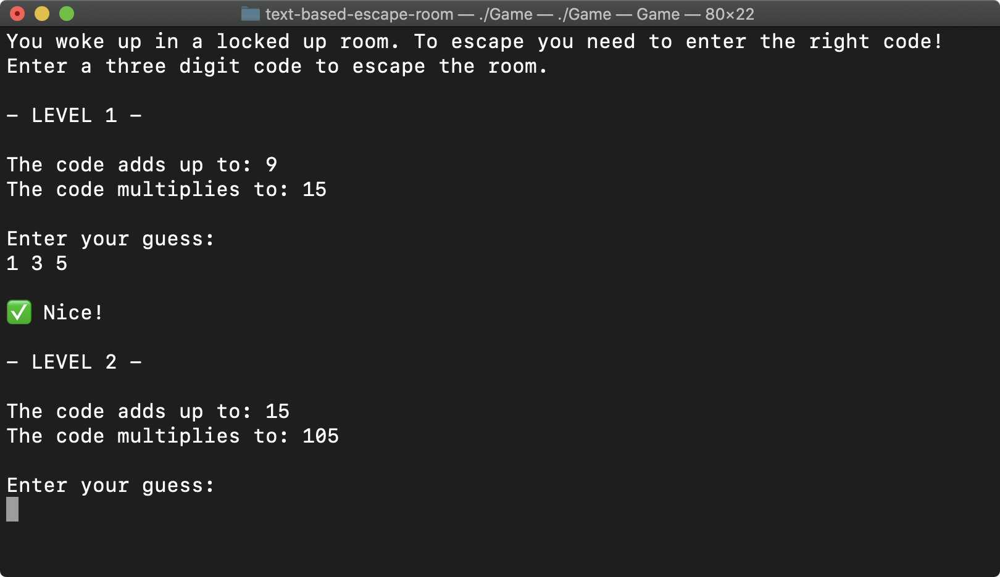

# Escape Room (text based)
## Incentive
**Learning C++. This is my first little C++ application to warm up with the language.**

## Game
In this short game you will be locked up in a room. Your only way out is by entering the right code for each level.

  

## How To Run it
1. Clone the repository.
2. Go into the directory
3. Create the executable with `g++ Game.cpp -o Game`
4. Run the game by typing `./Game` on Mac or `Game`on Windows.
